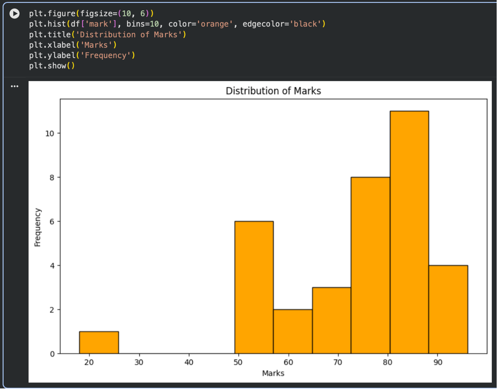
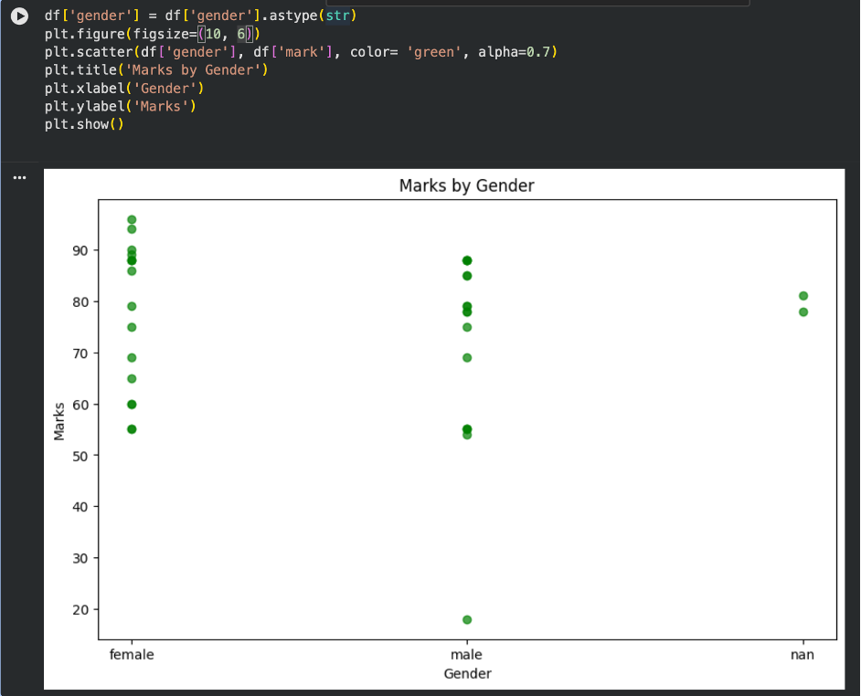
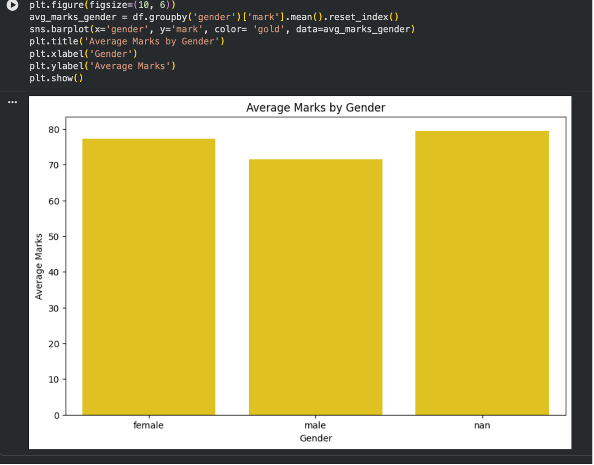
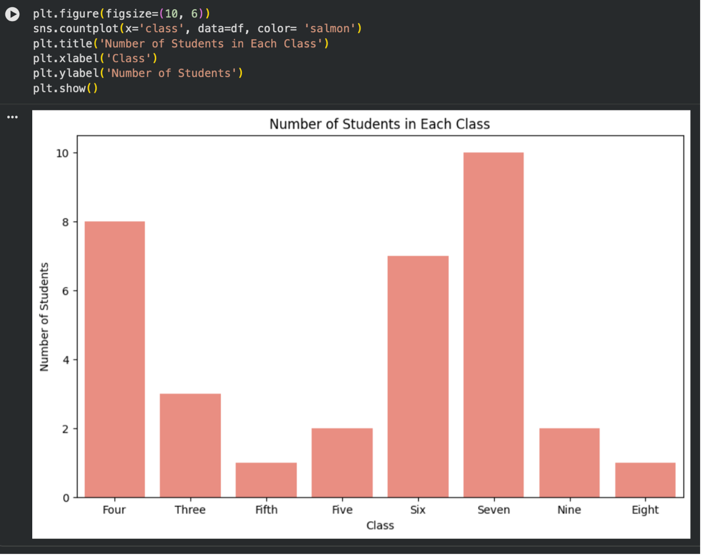
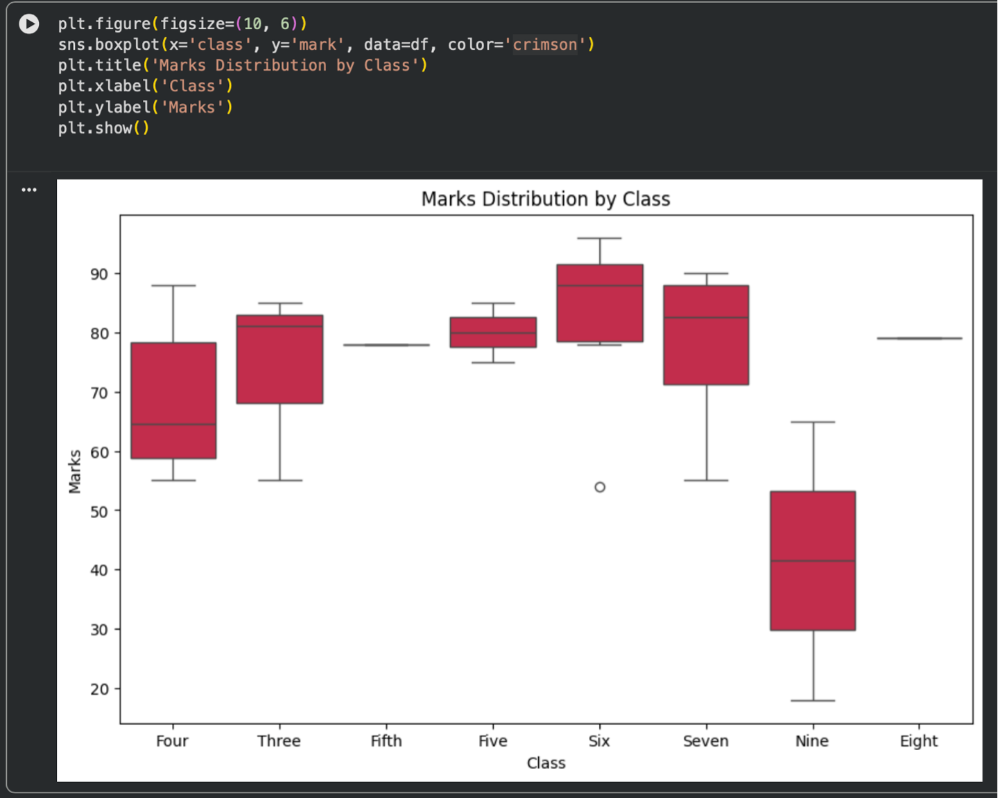

# Hi, I’m Anastasiia 👋
I’m building my portfolio to show the projects I created during my Data Analytics course.


## What I have learnt:
 Excel and data basics – I learned how to clean data, use formulas, create PivotTables, charts, and analyse datasets.

Python / Google Colab – I learned the basics of Python, working with Pandas, data cleaning, filtering, and visualising data.

SQL / MySQL Workbench – I learned how to query databases using SELECT, WHERE, JOIN, GROUP BY, ORDER BY, and aggregate functions.

Tableau / Power BI dashboards – I learned how to build interactive dashboards and create visualisations to present data clearly.


## Projects I have completed:
Excel  – Sales data analysis using PivotTables, charts, and formulas. 

Tableau  – Created an interactive dashboard to visualise business data and identify trends.

Power BI  – Built a dashboard with KPIs, charts, filters, and slicers.

SQL – Wrote SQL queries to retrieve, filter, join, and analyse data from multiple tables.

Python – Cleaned and analysed datasets using Pandas and created simple visualisations.


---


# ⭐EXCEL

## 📊 Retail Sales Analysis

### 📌 Project Overview

This project analyses retail sales data using Microsoft Excel. The aim was to explore customer purchasing behaviour, compare sales across different product categories, and present the results using Pivot Tables, charts, Conditional Formatting and Slicers.

---

### 🎯 Objectives

- Analyse total sales by gender.
- Compare sales across product categories.
- Create an interactive sales summary.
- Present business insights using Excel.

---

### 🛠️ Tools Used

- Microsoft Excel
- Pivot Tables
- Charts
- SUM
- Slicers

---

### 📈 Analysis Performed

- Cleaned and explored the dataset.
- Created Pivot Tables.
- Calculated total sales using the SUM function.
- Compared sales by gender.
- Compared sales by product category.
- Built a chart to visualise total sales by gender.
- Added Slicers for interactive filtering.

---

### 💡 Key Findings

- Electronics generated the highest total sales (£156,905).
- Beauty had the lowest total sales (£143,515).
- Female customers spent slightly more overall than male customers.
- Interactive filters make the report easier to explore.

---

### 📂 Project Files

- Retail_sales_Analysis.xlsx
- Source data
- Pivot Table
- Excel charts

---

### 🚀 Skills Demonstrated

- Data Analysis
- Microsoft Excel
- Pivot Tables
- Charts
- Data Visualisation
- Slicers
- Business Reporting

---

### 📸 Project Screenshots

Additional screenshots are available below.

- [📊 Excel Source Data](source-data.png)
- [📊 Excel Slicers](slicers.png)
- [📊 Excel Sales Chart](sales-chart.png)

----

# ⭐Tableu

## 🎵 Spotify Insights

### 📌 Project Overview

This Tableau dashboard analyses Spotify music data to explore artist popularity, track popularity, genres, and danceability. The dashboard provides interactive visualisations that help identify music trends and compare different artists and genres.

---

### 🎯 Objectives

- Analyse the most popular artists.
- Compare popularity across music genres.
- Explore the relationship between popularity and danceability.
- Identify the most popular tracks.
- Build an interactive Tableau dashboard.

---

### 🛠 Tools Used

- Tableau
- Interactive Dashboards
- Bar Charts
- Filters
- Calculated Fields
- Data Visualisation

---

### 💡 Key Findings

- Pop and Rap are among the most popular genres.
- Drake is one of the highest-ranked artists by popularity.
- Some highly popular artists have lower danceability scores.
- Interactive filters allow users to explore the data in more detail.

---

### 📂 Project Files

- Tableau Workbook (.twbx)
- Dashboard Screenshot

---

### 🚀 Skills Demonstrated

- Data Analysis
- Dashboard Design
- Data Visualisation
- Trend Analysis
- Music Data Analytics
- Storytelling with Data

---

### 📸 Project Screenshots

Additional screenshots are available below.

[Dashboard](Spotify.Insights.png)

----

# ⭐ Power BI
## 📊 Adventure Works Sales Dashboard (Power BI)

### Project Overview
This project was created in Microsoft Power BI using the Adventure Works sales dataset.  
The aim was to analyse sales performance, compare sales against targets, review profit trends, and present insights using interactive dashboards.

---

### 🎯 Objectives
- Analyse total sales and profit performance.
- Compare sales with targets.
- Identify variance and profit margin.
- Track sales trends by month, year and quarter.
- Create interactive reports using slicers and filters.

---

### 🛠 Tools Used
- Microsoft Power BI Desktop
- DAX
- Visual Calculations
- Slicers
- Matrix tables
- Bar charts
- Line charts
- KPI cards

---

### 📌 Key Findings
- Sales performance can be compared against targets using KPI cards and variance calculations.
- Profit changed across fiscal years, with visual calculations showing the difference from the previous year.
- Running sum helped to show cumulative sales over time.
- Interactive filters make the dashboard easier to explore by year and region.

---

### 🚀 Skills Demonstrated
- Data Analysis
- Power BI Dashboard Design
- KPI Reporting
- DAX Calculations
- Visual Calculations
- Running Sum
- Moving Average
- Sales and Profit Analysis
- Data Visualisation
- Business Reporting

---


### 📸 Project Screenshots

Additional screenshots are available below.

[Overview Dashboard](Overview.png)

[Sales Target Analysis](Sales.Performanca.vs.Target.png)

[Profit Analysis](Profit.Analysis.png)

[Running Sum Analysis](Running.Sum.Analysis.png)

[Matrix Report](Matrix.Report.png)


---


# ⭐SQL

### Project Overview

This project contains SQL queries created using the MySQL World sample database.  
The aim of this project was to practise SQL queries and demonstrate basic data analysis skills.

### Skills Demonstrated

- SELECT statements
- WHERE filtering
- ORDER BY
- LIMIT
- INNER JOIN
- LEFT JOIN
- GROUP BY
- COUNT()
- Table aliases
- Multiple filtering conditions

---
### 1. Country with the Highest Life Expectancy
```sql
SELECT Name, LifeExpectancy
FROM country
ORDER BY LifeExpectancy DESC
LIMIT 1;
```
### Result: Andorra has the highest life expectancy with 83.5 years.
---
### 2. Countries and Their Capital Cities

```sql
SELECT c.Name AS Country,
       ci.Name AS CapitalCity
FROM country c
JOIN city ci
ON c.Capital = ci.ID;
```
### Purpose: This query uses an INNER JOIN to show countries together with their capital cities.
---
### 3. Number of Cities by Country

```sql
SELECT c.Name AS Country,
       COUNT(ci.ID) AS CityCount
FROM country c
LEFT JOIN city ci
ON c.Code = ci.CountryCode
GROUP BY c.Code, c.Name
ORDER BY CityCount DESC;
```
### Purpose: This query uses LEFT JOIN, COUNT and GROUP BY to calculate how many cities are recorded for each country.

### 4. Official Languages in Europe

```sql
SELECT c.Name AS Country,
       cl.Language AS OfficialLanguage
FROM country c
JOIN countrylanguage cl
ON c.Code = cl.CountryCode
WHERE c.Continent = 'Europe'
AND cl.IsOfficial = 'T';
```
### Purpose: This query shows official languages in European countries using JOIN and WHERE conditions


Tools Used

* MySQL Workbench
* SQL
* MySQL World Sample Database

### Conclusion

This project helped me practise SQL queries for data analysis, including filtering, sorting, joining tables and aggregating data.

### 📸 Project Screenshots

Additional screenshots are available below.

[MySQL Country-capital ](MYSQL/country_capital_join.png)

[MySQL First 10 countries query ](MYSQL/first_10_countries_query.png)

[MySQL Highest life expectancy query ](MYSQL/highest_life_expectancy_query.png)

[MySQL Life expectancy query ](MYSQL/life_expectancy_query.png)

----


# 🐍 Python

### 📌 Project Overview

This project analyses student performance data using Python, Pandas, Matplotlib and Seaborn. The aim was to explore the dataset, visualise score distributions and compare student performance across different classes and genders.

---

### 🎯 Objectives

- Import and explore a dataset.
- Clean and prepare the data.
- Analyse student marks.
- Compare results by gender and class.
- Create clear visualisations to identify patterns.

---

### 🛠️ Tools Used

- Python
- Pandas
- Matplotlib
- Seaborn
- Google Colab

---

### 💻 Skills Demonstrated

- Data cleaning
- Data exploration
- Data visualisation
- Histogram
- Scatter plot
- Bar chart
- Count plot
- Box plot
- Grouping and aggregation
- Calculating averages

---

### 📂 Project Files

- 📄 [Student Dataset](student(1).csv)

---

## 📸 Visualisations

### 📊 Distribution of Marks



This histogram shows the overall distribution of student marks. Most students achieved scores between 70 and 90, which indicates generally strong performance.

---

### 👩‍🎓 Marks by Gender



This scatter plot compares student marks by gender and helps identify differences in performance.

---

### 📈 Average Marks by Gender



This bar chart compares average marks by gender, making it easier to understand overall performance differences.

---

### 🏫 Number of Students in Each Class



This chart shows how many students are in each class.

---

### 📦 Marks Distribution by Class



This box plot shows the spread of marks in each class, including median scores, variation and possible outliers.

---

## 💡 Key Findings

- Most students scored between 70 and 90 marks.
- Student performance was generally consistent across genders.
- Some classes achieved higher average marks than others.
- Box plots helped identify variation in marks between different classes.
- Visualisations made the data easier to understand.

---

## 🚀 What I Learned

Through this project, I strengthened my Python data analysis skills by working with Pandas, Matplotlib and Seaborn. I learned how to clean data, create different chart types, compare groups and communicate insights through data visualisation.

---

## 💻 Example Code

```python
import pandas as pd
import matplotlib.pyplot as plt
import seaborn as sns

df = pd.read_csv("student.csv")

plt.figure(figsize=(10, 6))
plt.hist(df['mark'], bins=10)
plt.title('Distribution of Marks')
plt.xlabel('Marks')
plt.ylabel('Frequency')
plt.show()

sns.boxplot(x='class', y='mark', data=df)
plt.title('Marks Distribution by Class')
plt.xlabel('Class')
plt.ylabel('Marks')
plt.show()
```
